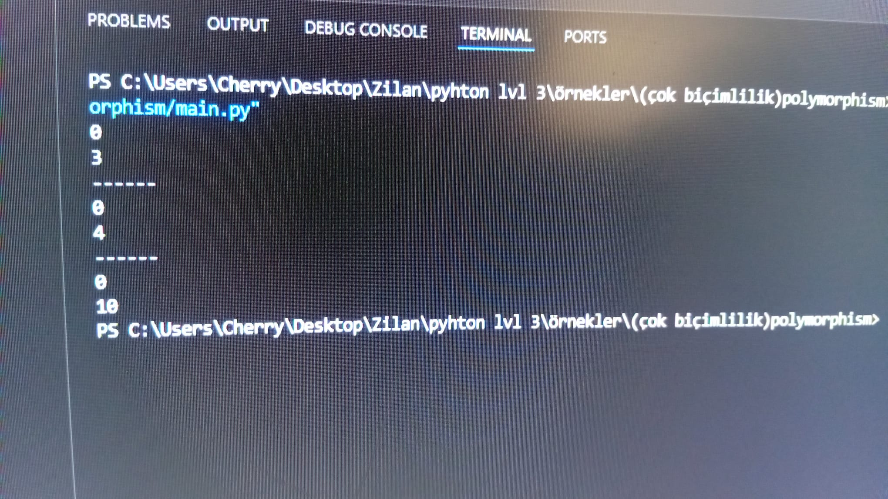

---Çok Biçimlilik (Polymorphism)---

Çok biçimlilik, nesne yönelimli programlamada aynı isimdeki bir metodun farklı sınıflarda farklı şekilde çalışabilmesidir. Yani bir metodun adı aynı kalır fakat her sınıf o metodu kendi ihtiyacına göre farklı şekilde uygular.

Bu örnekte bir Bird (Kuş) sınıfı vardır. Bu sınıfın move() adlı bir metodu bulunur ve kuşun hareket etmesini sağlar.

Daha sonra Pigeon ve Hawk adında iki sınıf oluşturulur. Bu sınıflar Bird sınıfından kalıtım alır. Ancak her biri move() metodunu farklı şekilde kullanır.

-Bird sınıfında move() metodu kuşun konumunu 3 artırır.

-Pigeon sınıfında move() metodu kuşun konumunu 4 artırır.

-Hawk sınıfında move() metodu kuşun konumunu 10 artırır.

Böylece aynı move() metodu çağrılsa bile her kuş türü farklı şekilde hareket eder. Bu durum polimorfizm yani çok biçimlilik kavramını gösterir.

Bu kod çalıştırıldığında her nesne kendi move() metoduna göre hareket eder. Bu da çok biçimliliğin nasıl çalıştığını gösterir.

